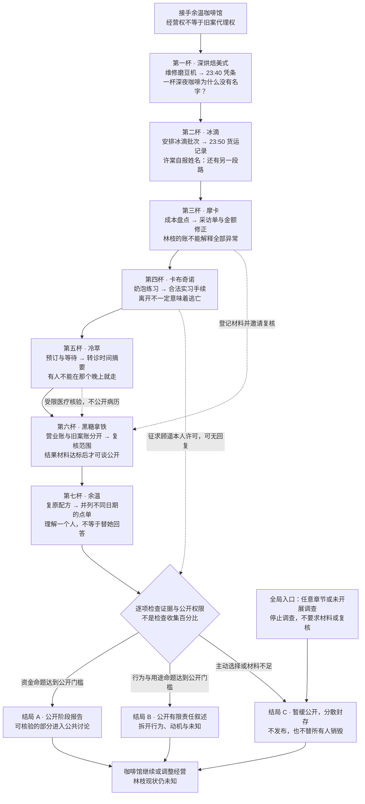
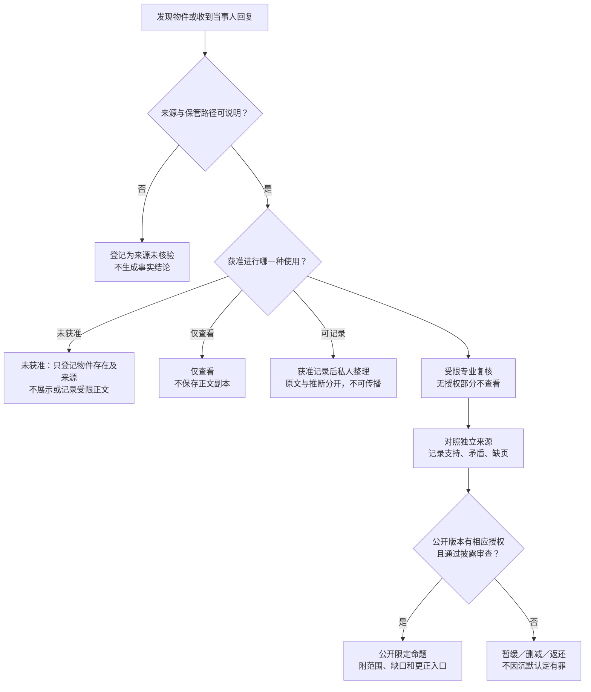

# 《余温咖啡馆》新游戏故事线与接入说明

版本：新游戏内容包 v0.1，2026-09-29。含剧透，仅供制作人员。

本包提供叙事设计和可展示文字，不是已经接入引擎的运行数据。与同目录《材料碎片.md》配套使用。下面的 Mermaid 图可在支持 Mermaid 的 Markdown 工具中预览、编辑与导出；不依赖生成式图片，文字和节点可以精确修改。

当前24件材料覆盖七章调查，但EV-021仅为核验范围通知，不是核验结果。因此图中的两个公开结局是目标分支，尚需补齐实际达标的资金原件对应关系与结果材料；当前包不能假称这两个分支已具备全部内容。有限调查及暂缓公开分支不受此缺口阻塞。

## 1. 整个故事先讲明白

十二年前，余温咖啡馆参与了一套不完全合规的互助机制。六个处境不同的人借助暖灯基金寻求帮助；管理资金的赵衡却挪用过钱，并利用隐私控制受助者。发现问题的许棠带走了涉及身份的部分账册。

林枝拿走基金中的一笔钱，改写了记录，为分批离开的人提供支持。这些行为既包含保护，也包含未经充分同意的替人决定。争执中发生了一场意外火灾。拿钱、假账、火灾和许棠离开的消息，被小镇拼成了一个看似简单的解释：林枝偷钱、烧毁证据，然后逃走。

真相没有被某一个人完整保管。陈槐只知道自己开过的一段路，沈秋知道医疗安排，顾言知道合法手续，叶澜知道没有发表的采访，罗桥记得自己改过的数字。周闻的沉默保护了人，也让林枝独自承受恶名。

十二年后，玩家接手的不是调查任务，而是一家需要活下去的咖啡馆。维修磨豆机时，一张深夜出杯凭条进入视线。恢复旧菜单让旧客人重新坐下；玩家每问深一步，都可能影响今天的订单、合作与某个人好不容易建立的生活。

最终，玩家能够拆开旧传闻中的几件事，却无法获得上帝视角。最后一杯“余温”不会显示答案。玩家必须决定：公开已经能够负责的材料、只讲有限的责任边界，还是暂缓公开。这三种选择都不能代替七名被保护者决定他们的人生。

## 2. 玩家故事线总图

实线表示推荐的章节推进；虚线表示可选调查。章节进入不要求上一章材料全部收齐。

普通营业从头到尾始终可选。拒绝调查不导致破产；菜单解锁不等于证人同意；线索缺失不阻止玩家做咖啡。

## 3. 作者时间线：不能直接放进玩家图鉴

旧案火灾当夜记为 T0；周闻去世日记为 D0。两套标记不能混用。火灾发生的具体时分尚未锁定，不插入虚构精确时间。

```mermaid
flowchart LR
    A["T0 之前<br/>互助机制运作<br/>赵衡挪用并控制隐私"]
    B["T0 前后<br/>林枝拿钱、改账<br/>争执引发意外火灾"]
    R1["T0 23:40<br/>方宁 · 沈秋安排夜班车"]
    R2["T0 23:50<br/>贺川 · 陈槐豆袋车"]
    R3["T0 23:55<br/>许棠 · 带身份账页离开"]
    R4["T+1 07:10<br/>唐禾 · 何记者接应"]
    R5["T+3<br/>顾遥 · 合法学校手续"]
    R6["T+7<br/>沈禾 · 医疗转诊"]
    R7["T+第二周<br/>罗桥 · 外地工作接应"]
    S["此后十二年<br/>各自生活、各自沉默<br/>材料分散保存"]
    NOW["当下<br/>周闻信件与玩家开店<br/>碎片重新相遇"]
    A --> B
    B --> R1 --> S
    B --> R2 --> S
    B --> R3 --> S
    B --> R4 --> S
    B --> R5 --> S
    B --> R6 --> S
    B --> R7 --> S --> NOW
```

图中的并列支路是作者整理，不表示所有人参加过统一会议。箭头不代表火灾一定先于每一趟离开；仅表示这些离开属于同一旧案时期。

当下信件链：D-14 写信 → D-2 寄出 → D0 周闻去世 → D1 入箱 → D9 许棠领取 → D10 回镇 → D12 开店 → D13 回店并在第二杯相关场景中自报姓名。

邮件到达和死亡没有神秘因果。许棠的领取资料只能由她后来提供，不能凭空出现在周闻生前的交接文件夹。开店手续在叙事上应在 D12 前完成；申请回执本身不是营业许可。

## 4. 七章实际怎么玩

以下是新游戏改编方案。关系变化要由人物看见的行为触发，不由玩家私下档案操作触发。

| 章节 | 经营目标 | 调查动作与认知变化 | 当下关系后果 | 下一章牵引 |
| --- | --- | --- | --- | --- |
| 1 没有主人的咖啡豆 | 修复磨豆机，稳定美式出杯 | 从旧凭条发现深夜出杯；陈槐只确认自己23:50的运输 | 公开货运细节后，陈槐暂停未承诺加单；合同订单仍足额 | 谁留下提醒不要追问座位的纸条？ |
| 2 两条不重叠的夜路 | 做首批冰滴，协调冷藏和促销 | 货运单与笔记分开看；许棠说明信件和身份 | 玩家尊重引用范围，叶澜愿意继续核对；不意味着她交出采访对象 | 如果只有一笔偷款，为什么材料时间对不上？ |
| 3 账面之外 | 摩卡成本与现金结算 | 唐禾对应采访预约，罗桥对应金额修正；两人不是同一证据源 | 公开指认会使匿名来源暂停；先结工资再查旧账维护员工关系 | 当晚没走的人，后来怎样离开？ |
| 4 合法的离开 | 练奶泡与维护菜单文案 | 正式手续动摇“所有人都在逃亡”的传闻 | 顾言可以转达邀请，顾遥可以不回复；文案修正不等于获得许可 | 合法手续能保护人，为什么有人还要等七天？ |
| 5 慢一点到达 | 冷萃预订、批次安排和团购取舍 | 转诊摘要说明等待的必要；现金补足者仍待核 | 沈秋愿意谈安排，不愿拿病历为任何人作道德证明 | 不同用途的钱为什么被合并讲成一笔？ |
| 6 三栏账 | 将当前营业账和旧案工作表分开 | 用已见／可推／未知三栏登记多个资金类别；先得核验范围通知，实际结果材料仍待补 | 罗桥可承认自己修改记录而不接受公开身份；许棠拒绝批量授权 | 我们想洗清的是一个罪名，还是把一个人写成圣人？ |
| 7 余温不替人回答 | 复原余温、决定是否办说明活动 | 不同日期点单只能产生推测；公开内容逐项核对 | 许棠写清自己的责任；无人被强迫回来、原谅或见面 | 玩家怎样承担已经知道的部分？ |

“三栏账”是证据状态三栏，不是资金只有三种。营业收入、疑似赵衡异常、基金补账、林枝相关支出至少分四类，不把账栏名称直接写成定罪结论。

### 第一章必须立刻发生的异常

先让玩家做一杯不好喝的咖啡，再为了修机器发现旧纸。别先让玩家读手续或基金历史。

1. 磨豆机卡住，玩家停机清理维修护套。
2. 旧凭条的“23:40”先露出来；姓名栏没有可辨认文字。
3. 复做美式后，送货的陈槐注意到玩家展示的凭条，或接受玩家私下询问。
4. 他确认自己23:50走过，但明确不知道23:40是否有车。没有公开展示时，不播放“你写在黑板上”的指责台词。
5. 打烊发现当日收据纸上的提醒；第二天那名普通客人问：“纸条还在吗？”

第一章不弹出方宁、贺川姓名，不宣告两辆车均已证实；玩家此时掌握的是两个不同时间节点。

### 中段必须有推进，不全是“不能公开”

每章至少交付一个肯定的局部答案：另一段运输存在；不同账目不能直接合计；合法手续确实存在；医疗安排要求等待；独立来源的记录能够比较。它们不足以定罪，但足以推翻“一个坏人、一笔钱、一次逃亡”的简单解释。

NPC的边界写在动作里：陈槐把追加订单划掉，叶澜盖住笔记下半页，顾言拿走印着“被拯救”的菜单草稿。避免所有人都像审计员一样重复说明证据规则。

### 终章必须给情感回报

建议收尾场景（新扩写）：许棠把自己的陈述折好，不交出其他人的部分。玩家照常递来一杯余温，把搅拌匙放在碟边，而不是替她搅开。她决定要不要搅、喝完还是带走。这里不出现林枝的回信或身影，不把一个陌生来客暗示成确定归来的林枝。

这不是对所有人的赦免，而是玩家终于停止替人决定的一次具体行动。

## 5. 证据如何进入故事：状态图

材料持有人授权不是第三人的隐私总授权。特别是医疗与家庭资料，还需要相应当事人许可或经核实的合法处理依据；本游戏默认无许可就不收集该部分。律师审核也不创造缺失的许可或事实。

复核说明应列“查看过哪些材料、没看哪些、能对应哪些字段、有哪些矛盾”，而不只给一枚“可信”印章。来自同一原件的两份抄本不算两个独立来源。

## 6. 三个结局的可执行门槛

以下是设计条件，不是现有引擎字段。判断单位是“拟公开命题”，不是道具数量。

### E-A：公开阶段报告

每条公开的资金异常命题需要：

- 有定位到原件或明确标识副本层级的来源；
- 至少两条独立记录能交叉比较，且差异已经说明；
- 受限复核完成，报告明确哪些身份和用途未验证；
- 该版本具备披露权限，个人识别风险已检查；
- 不能写“赵衡已经被定罪”“全部款项已经查清”。

少一项就删去该命题，不因其他命题达标而一并发布。没有任何命题达标时，禁用发布，显示具体缺少什么；仍可结束调查。

### E-B：公开有限责任叙述

除上述适用于该叙述的来源与披露要求外：

- “林枝拿过钱”“林枝改过账”“部分支出可能与保护有关”各自有材料支持，不能互相代替证明；
- 支持不足的句子删除或明确标为未证实，不把作者圣经的事实自动写入报告；
- 不使用无许可的私人对话、感情关系、医疗信息；
- 不以林枝无法联系作为她默认同意的证据。无法取得许可的私人内容不进入此结局。

它不是“完美洗白结局”。公开后仍可能有争议、误读和更正工作。

### E-C：暂缓公开，分散封存

始终可选，不需要先付费复核或集齐七杯。只处理玩家有权处理的工作副本；原件由持有人决定去留，不能替别人销毁，也不能交给许棠统一掌管。

没有举办过公开活动时，不扣一笔凭空产生的活动损失。已经接下的活动订单按实际取消条款结算。客流变化不是道德评分，不保证选择隐私就必然赚钱或亏钱。

### 已经错误公开怎么办

最终选封存不能撤销历史泄露。保留曾公开过的版本、撤回和更正记录；相关角色是否继续合作另行决定。停止公开是补救的开始，不是信任清零重置。

## 7. 新游戏接入最小规则

建议把“作者备注”和“玩家可见内容”存成不同资源，禁止一次性把全文送入图鉴。

每件材料至少需要：

| 字段 | 用途 |
| --- | --- |
| id / chapter / coffee | 稳定编号、推荐章节、关联咖啡 |
| player_text | 当前允许展示的正文；不能混入作者姓名映射 |
| author_truth | 仅制作端可见，不参与自动揭示 |
| source / custodian | 谁提供、谁保存、原件或副本 |
| discover_conditions | 可触发的经营动作和场景前置 |
| access_scope | 未获准／仅查看／可记录／受限核验 |
| disclosure_scope | 禁止／仅删减版／指定全文；与查看权分开 |
| claims | 支持、反驳、不能推出的命题 |
| revealed_names | 已由场景合法揭示的姓名，默认空 |
| witnessed_events | NPC 实际知道的行为及消息路径 |
| consequences | 订单、营业时间、合作范围；数值待调试 |
| alternative | 错过后的再访问途径；不凭空补发原件 |

信任值可以影响邀请是否被接受，但不能购买隐私授权。重复出杯不重复领取证据或无限增加关系。咖啡配方始终有经营用途；受助者拒绝访谈时依然可以解锁并出售饮品。

最小试玩建议：先做第一、二章及一个有限结束选项。验收下面五条再接后续：

1. 不公开凭条的玩家不会听到公开分支的指责。
2. 玩家可以不追问姓名，照常营业并遇到次日回店事件。
3. 陈槐不能因为玩家私下整理档案暂停加单。
4. 在许棠自报身份前，图鉴、标题、配音字幕都不泄露她的姓名。
5. 只持有23:40凭条时，推理板不能生成“方宁乘车安全离开”。

## 8. 本次变更审计与版本差异

- 新增：七章推荐推进图、作者旧案时间图、证据状态图、命题级结局门槛、终章动作及接入字段；均为新游戏设计，不代表已实现。
- 保持：六名受助者加许棠、七杯咖啡、分批离开、意外火灾、赵衡资金问题、林枝拿钱改账、林枝现状未知。
- P1 修订①：旧场景稿第一章提前问“是不是方宁”；本包改为未知当事人，待当事人许可与来源核验后揭示。
- P1 修订②：旧场景稿把 D9 领取回执放进生前交接文件夹；本包改为许棠自报身份后主动出示。
- P1 修订③：旧场景稿把“私下观察七号桌”与许棠目击并存；本包要求具体视线或主动告知，私下行为不触发目击。
- P1 修订④：旧文把“暂缓公开”也锁在证据门槛之后；本包始终允许停止，不把调查变成强制消费。
- P1 修订⑤：旧稿称暗账足以直接证明犯罪，与资金证据分散冲突；本包采用受限命题，不用身份账页自动定罪。
- P1 修订⑥：旧稿存在“持有人同意就能公开第三人资料”的歧义；本包分开保管权、核验权和个人披露权。
- 受影响章节：1、2、3、5、6、7；原设计文档暂未回写，移植时以本包明确修订的条目为准，不能混用旧对白。
- 案内保留缺口：完整资金去向、火灾具体责任的可公开证据、林枝现状。未知不是自动补出的反转。
- 制作待验收：新物件正文、视觉制作、具体资金样例数字、经营数值、引擎契约、UI与存档迁移。
- 本包没有提供司法定案结局；如新游戏需要该结局，必须另写原件来源与程序，不能给当前材料加一个“已定罪”标签。
- 独立图文复核：补入任意阶段停止调查的全局入口；将材料权限检查前移，拆开未获准、仅查看和可记录，避免按图接入时多授予权限。
