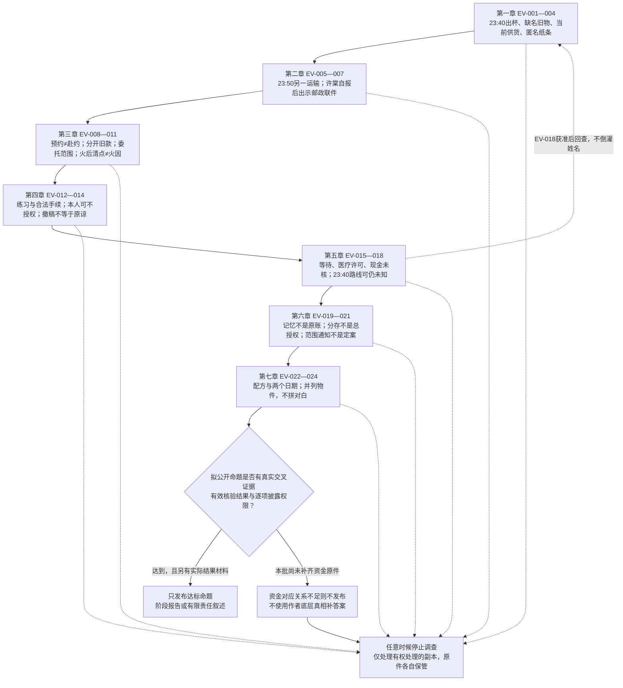

# 《余温咖啡馆》材料碎片

版本：新游戏设计 v0.1；待验收、待迁移。仅本文件新增，不回写旧稿，不生成图片。

## 使用边界与修订口径

依据已全文阅读的写作循环、故事圣经、七章场景稿、写作审计反馈及同目录《故事线与接入说明》编制。以下24件均有可展示正文，但“有正文”不等于玩家默认有权看见或保存。所有新物件文字、具体保管细节、交互条件和视觉提示均为**待验收设计**，不冒充既有定案。

- 作者底层真相、登记索引和审计仅供制作端；玩家只能读取取得相应许可的“玩家可见正文”。姓名映射不得流入标题、字幕、图片替代文本或未解锁图鉴。
- 停止调查始终可选，零材料、零复核也可以结束；普通营业与配方练习不以交出隐私为门票。替代路径不是绕过拒绝，更不是补发丢失原件。
- 权限分为查看、复制/摘录、受限专业核验、公开四项。仅查看时不保存正文到图鉴，不自动截图；仅登记“曾获准查看、来源、范围”。未许可则连受限正文也不展示。
- 原件分散保管。店内只能保管本就属于店内的旧物及获准保留的副本，纸张置于干燥上锁柜，不进冰箱。来源相同的复印件、笔记和摘要不算独立证据。
- 材料持有人不拥有第三人隐私总授权。医疗材料默认必须取得患者本人具体许可；沈秋不能单独开放患者记录，会计与律师也不能创造许可。
- D为周闻去世日的相对日期；T为十二年前火灾当夜的相对日期。正文中的D/T是制作期日期转写，不声称原件印着这些代号；具体公历日期未定，禁止擅填。遮盖项明确标为删减，不做可刮开谜题。
- 第一章只有23:40出杯和陈槐确认的23:50运输，不能宣告23:40存在车辆，更不知道方宁、贺川姓名。豆袋缺名也不能独自证明故意保护。
- D9领取回执只由许棠在第二章、两次完整经营交互后自报身份，再自愿出示；绝不出现在周闻生前交接夹。邮戳、入箱、领取分开证明。
- 生前信件不预知死亡；本文件将旧信开头改为对病情与未来的不确定表述。不同日期的两张点单绝不拼成逐字对白。

### 仅制作端：作者底层事实

六名受助者是方宁、贺川、唐禾、顾遥、沈禾、罗桥；许棠是账册持有者兼被保护者，不是第七名基金受助者。赵衡挪用与隐私控制、林枝拿钱改账、周闻参与不完全合规互助及沉默，是作者底层事实，不自动成为玩家已证命题。火灾是争执中的意外，具体起火时分与可公开责任证据未定。

方宁T0 23:40由沈秋安排正规夜班车；贺川T0 23:50由陈槐送至邻县货运站；许棠T0 23:55自行离开；唐禾T+1 07:10由何记者接应；顾遥T+3走合法学校手续；沈禾T+7转诊；罗桥T+第二周通过工作接应离镇。这是分散行动，不是完整路线表曾存在的证明。林枝当下是否在世、所在何处和联系意愿一律未知。

## 登记索引

姓名列仅为作者映射；推荐章节不是收集强制顺序。每件仅占一个ID，附件和分面不另算数量。

| ID | 推荐章／咖啡 | 名称 | 作者关联 | 玩家初见层级 |
|---|---|---|---|---|
| EV-001 | 一／深烘焙美式 | 23:40收款凭条 | 方宁入口，未证对应 | 店内旧原件 |
| EV-002 | 一／深烘焙美式 | 缺角豆袋与试磨字迹 | 方宁入口，未证对应 | 店内旧原件 |
| EV-003 | 一／深烘焙美式 | 临时加单批注 | 陈槐、当下供货 | 当前业务单 |
| EV-004 | 一／深烘焙美式 | 七号桌的新纸条 | 许棠 | 当下匿名纸条 |
| EV-005 | 二／冰滴 | 油浸货运单 | 贺川、陈槐 | 获准删减查看 |
| EV-006 | 二／冰滴 | 未发表采访笔记 | 叶澜 | 获准摘录 |
| EV-007 | 二／冰滴 | 来信及邮政联件 | 周闻、许棠 | 自报身份后自愿展示 |
| EV-008 | 三／摩卡 | 采访预约单上半页 | 唐禾 | 删减件 |
| EV-009 | 三／摩卡 | 匿名金额修正函 | 罗桥 | 主动投递件 |
| EV-010 | 三／摩卡 | 单项核验委托卡 | 陈槐、会计 | 当前授权记录 |
| EV-011 | 三／摩卡 | 火后器具清点页 | 周闻、火灾 | 店内旧原件 |
| EV-012 | 四／卡布奇诺 | 奶泡练习单 | 顾遥、林枝 | 店内旧原件 |
| EV-013 | 四／卡布奇诺 | 实习通知删减面 | 顾遥、顾言 | 条件许可查看 |
| EV-014 | 四／卡布奇诺 | 撤下的菜单校样 | 顾言、当下关系 | 玩家当前工作件 |
| EV-015 | 五／冷萃 | 冷却后再入口 | 沈禾、林枝 | 店内冲煮卡 |
| EV-016 | 五／冷萃 | 转诊时间摘录 | 沈禾、沈秋 | 患者许可条件件 |
| EV-017 | 五／冷萃 | 未归账的现金页 | 周闻、资金 | 店内旧原件 |
| EV-018 | 五／冷萃 | 夜间转介时间卡 | 方宁、沈秋 | 本人许可条件件 |
| EV-019 | 六／黑糖拿铁 | 咖啡渣金额草稿的说明面 | 罗桥 | 获准删减查看 |
| EV-020 | 六／黑糖拿铁 | 半张账页的分存说明 | 许棠 | 自愿展示的遮盖件 |
| EV-021 | 六／黑糖拿铁 | 有限核验范围通知 | 会计、律师 | 当前流程记录 |
| EV-022 | 七／余温 | 七号桌配方草稿 | 林枝、许棠 | 店内旧原件 |
| EV-023 | 七／余温 | 较早日期的点单背面 | 许棠 | 许棠自愿展示 |
| EV-024 | 七／余温 | 较晚日期的点单背面 | 林枝 | 店内旧原件 |

## 第一章：没有主人的咖啡豆

### EV-001｜23:40收款凭条

- **所属章／咖啡：** 第一章，深烘焙美式，D12维修发现。
- **玩家可见正文：**
  > 深烘焙美式 ×1  
  > 出杯：23:40　已收  
  > 杯盖另放。  
  > 背面铅笔：下次调粗一点，前一杯太涩。
- **制作视觉提示：** 褪色收款纸、背面铅笔较清晰；旧案日期仅显示已锁定日期的转写，不造金额、签名或车牌。
- **原持有人及保存／发现路径：** 店内收款件，周闻拿来记研磨参数，夹进磨豆机维修护套；停机清洁才取出。保存方式为新扩写。
- **何时可知姓名：** 本件永不揭名；第一章称“深夜出杯记录”。后续即使取得EV-018也不能仅靠时间将付款人认成方宁。
- **获得条件与替代路径：** 修机并核对出杯；错过可营业后复查护套，不必为调查停业；也可不查。
- **能证明／不能证明：** 纸面记载当晚23:40出杯付款；不能证明谁喝、谁付、车是否存在、救助或资金来源。
- **查看和公开权限：** 可查看并记录无身份字段；公开旧日期关联仍需风险审查，不自动允许把原图当宣传。
- **影响活人／经营后果：** 试磨耗豆；私下收存不触发NPC反应。主动展示才让陈槐知道玩家看过时间。
- **关联碎片ID：** EV-002、EV-005、EV-018。
- **作者底层真相／扩写标记：** 作者知道方宁转移时间，但本凭条与她的对应尚无独立确证；正文和保管细节待验收。

### EV-002｜缺角豆袋与试磨字迹

- **所属章／咖啡：** 第一章，深烘焙美式。
- **玩家可见正文：**
  > 深烘焙  
  > 开袋后夹紧，放干处。  
  > 试磨：先少量。水温往下降一点。  
  > 留半袋，不要混进新豆。
- **制作视觉提示：** 空牛皮纸袋，标签一角缺失；不能在撕口残笔中藏可识别姓名。只拍空袋，不表现十二年旧豆可饮用。
- **原持有人及保存／发现路径：** 林枝用过的袋，周闻收作配方样袋放在维修资料盒；玩家盘点时发现。旧豆已不供饮用。
- **何时可知姓名：** 不由袋子揭示；林枝笔迹也先标“未核验”，不能读图鉴偷知方宁。
- **获得条件与替代路径：** 处理苦味投诉后查旧参数；可打烊后查资料盒，使用当下安全新豆练习。
- **能证明／不能证明：** 有缺口和冲煮备注；不能单证名字被故意撕掉，更不能证明保护动机。
- **查看和公开权限：** 可看、可录技术参数；私人关联不公开，配方教学图应重绘且去掉旧案日期。
- **影响活人／经营后果：** 改参数需重试，降低客诉不等于获得证言；不把苦难卖作豆名。
- **关联碎片ID：** EV-001、EV-015、EV-022。
- **作者底层真相／扩写标记：** 无名豆袋沿用圣经；具体收存位置与字句待验收，不把作者的撕名事实直接写入玩家结论。

### EV-003｜临时加单批注

- **所属章／咖啡：** 第一章，美式供豆关系。
- **玩家可见正文：**
  > 已确认订单：照原单交付。  
  > 临时追加：本次不接。  
  > 请把旧车次从店门口那张纸上撤下，现货仍按现货验收。  
  > 陈槐
- **制作视觉提示：** 当下送货单附签，追加栏一条横线，已确认订单栏不涂改数量。
- **原持有人及保存／发现路径：** 陈槐当下签写，随本次交货交玩家；不是旧案原件。
- **何时可知姓名：** 当前供应商自我介绍时可知陈槐；无乘客姓名。
- **获得条件与替代路径：** 仅在玩家公开旧货运信息且陈槐送货看见后出现此版本；不公开则只有正常送货单，不补发本件。可主动询问供货边界但不能伪造他看见过公告。
- **能证明／不能证明：** 当前加单被拒、既有订单继续履行；不能证明其心虚或承认参与全套转移。
- **查看和公开权限：** 可看、可复制留作经营凭证；公开合同与旧案关联另征供应商许可，不能整单贴墙。
- **影响活人／经营后果：** 只暂停未承诺加单；可缩菜单或询价替代供货，无断供、无全镇封锁。撤稿不保证立刻恢复关系。
- **关联碎片ID：** EV-005、EV-010、EV-014。
- **作者底层真相／扩写标记：** 触发沿用新接入规则，单据文字待验收。

### EV-004｜七号桌的新纸条

- **所属章／咖啡：** 第一章，深烘焙美式末尾。
- **玩家可见正文：**
  > 如果你已经做了第一杯，请先别问谁坐过那张桌子。
- **制作视觉提示：** D12新收据纸背面手写，无旧化、烧痕或姓名；烧毁仅为玩家选择后的状态。
- **原持有人及保存／发现路径：** 许棠D12离店前留下，打烊擦桌发现；不依赖她看见玩家私下试杯。
- **何时可知姓名：** 当时只称“留条的客人”；第二章两次完整经营交互后，她本人自报许棠。
- **获得条件与替代路径：** 擦七号桌；次日D13她固定回店可讨论纸条是否还在。烧掉后不恢复正文图鉴，玩家可在许可下保存自己的非逐字摘要并标明来源等级。
- **能证明／不能证明：** 有人提出当下边界请求；不证明她知道玩家私下操作或掌握全部旧案。
- **查看和公开权限：** 可读，复制留档须在D13取得写条者许可；未许可不保存正文副本。禁止公开。
- **影响活人／经营后果：** 只影响当面对话与保存目的协商；叶澜、罗桥不因收烧纸条自动出现。
- **关联碎片ID：** EV-007、EV-020、EV-023。
- **作者底层真相／扩写标记：** 原句沿用场景稿；复制许可与烧毁档案表现为待验收设计。

## 第二章：两条不重叠的夜路

### EV-005｜油浸货运单

- **所属章／咖啡：** 第二章，冰滴；第一章只有陈槐局部口述。
- **玩家可见正文：**
  > 豆袋配送　出车记时：23:50  
  > 交接：邻县货运站  
  > 空袋随下趟带回。  
  > 手写：随车一人；不随货返程。  
  > 本面已遮去车辆及业务识别信息。
- **制作视觉提示：** 油晕和折线真实可读；遮盖车号、客户号，不藏姓名彩蛋。
- **原持有人及保存／发现路径：** 陈槐留存的配送底单，原件一直在其业务档案，因对旧车次的询问带来删减展示件；不移交原件。
- **何时可知姓名：** 乘客仍匿名；贺川姓名只有本人愿意联系并明确许可后才可进入玩家档案，无固定必得章节。
- **获得条件与替代路径：** 验新豆、协调冰滴批次后约看；错过可请求另约，拒绝则保留陈槐口述为较弱来源，不能拿EV-006冒充原件。
- **能证明／不能证明：** 底单记载运输与随车者；结合陈槐说明支持一段运输，不证明最终去向、乘客身份或23:40车。
- **查看和公开权限：** 默认仅看删减件；摘录须另同意。专业核验见EV-010；公开车次及关联须独立审查，乘客隐私不由陈槐代许。
- **影响活人／经营后果：** 占用交货核对时间；公开易把现在业务连到旧案，陈槐仅对其实际看见的发布回应。
- **关联碎片ID：** EV-001、EV-003、EV-006、EV-010。
- **作者底层真相／扩写标记：** 贺川路线沿用；单据文字、底单留存细节待验收，纸面不替代本人身份确认。

### EV-006｜未发表采访笔记

- **所属章／咖啡：** 第二章，冰滴。
- **玩家可见正文：**
  > 运输时间：23:50左右——陈述来自司机，未随车。  
  > 到货时间和人员去向分开核。  
  > 23:40：我没有见过车辆。  
  > 暂不刊。缺可公开的交叉材料。  
  > 本页为工作笔记节选，采访对象信息已删。
- **制作视觉提示：** 横线本节选，蓝笔旁注与当下删减标记分层，不伪装已刊报纸。
- **原持有人及保存／发现路径：** 叶澜保留未刊稿工作本，D13—D15核对日期时提供自己制作的节选；来源本在她处。
- **何时可知姓名：** 叶澜可自报姓名；采访对象保持匿名，不能据此叫出贺川。
- **获得条件与替代路径：** 冰滴订单交谈并接受匿名边界；错过可约下次核对。拒绝匿名则无此件，可继续经营或查看已获准的货运信息。
- **能证明／不能证明：** 证明叶澜当年记录过一项说法及未刊原因；其中运输信息来自陈槐，与EV-005不算独立运输证据。
- **查看和公开权限：** 允许留此节选供私下核对，不许转给许棠或公众；引用须叶澜另审，涉及第三人内容仍须对应许可。
- **影响活人／经营后果：** 整理占用一次促销准备时段；擅自转交被得知后可暂停合作，不用全知好感扣分。
- **关联碎片ID：** EV-005、EV-008、EV-021。
- **作者底层真相／扩写标记：** 未发表笔记既有，具体字句待验收；不新增火灾目击。

### EV-007｜来信及邮政联件

- **所属章／咖啡：** 第二章，冰滴后身份确认；信中配方指向余温。
- **玩家可见正文：**
  > 许棠：  
  > 这阵子我守不住整晚的店了，怕有些话再拖下去，又没有说。你收到时我能不能亲自开灯，我也不知道。  
  > 先别急着回来，也别急着替谁证明清白。赵衡已经不在了，但那些人的生活不该因此重新被翻出来。  
  > “余温”我重新写了一遍：糖浆最后加入，不搅匀。搅拌匙另外放。  
  > 我当年没有替林枝说话。我怕开口以后，七个人又变成账上的名字。这件事，我一直没法说自己做对了。  
  > 愿意回来，就看看后厨旁那张我们叫作第七张桌子的工作桌。不愿意，也没有关系。  
  > 周闻
  >
  > 信封展示面：寄出地邮戳〔地名待统一〕／寄出日期 D-2。地址已遮盖。  
  > 转寄入箱记录节选：本件 D1 入箱；不代表收件人领取。  
  > 领取回执展示面：本件 D9 由收件人许棠领取；箱号、证件信息已遮盖。
- **制作视觉提示：** 三个邮政面与信纸分别翻页；信纸背面浅收据压痕，不添加可读名单。D-14写信信息只能来自信上落款或许棠说明，不能用邮戳冒充。
- **原持有人及保存／发现路径：** 周闻D-14写、D-2寄；管理方D1入箱；许棠D9领取并保存信、入箱记录节选与领取回执留存联，D10回镇。留存联及入箱节选取得方式为待验收邮政道具设计；未落实不能假称系统已查到。
- **何时可知姓名：** 第二章完成第二杯相关交互、累计两次完整经营交互后，许棠先自报姓名，再主动拿出。姓名不可由信封先泄露。
- **获得条件与替代路径：** 自报身份后征询、她愿意才查看。她不出示可只保留其口述“收到信”，邮政链标未核验；后续可再邀，不从交接夹或邮局偷偷补查。
- **能证明／不能证明：** 邮戳证寄出、记录证入箱、回执证领取；私密配方、工作桌称呼、旧纸压痕支持许棠个人识别来源，不是法庭鉴定；信不证明林枝现状或死亡预知。
- **查看和公开权限：** 默认仅查看删减面，不自动复制。许棠可另许可摘录自己的收信说明；私信及涉及林枝的私人内容不公开，许棠收信不赋予其代理林枝的权利。
- **影响活人／经营后果：** 留出非高峰安静桌位；拒绝展示不影响她固定回店，不以披露换咖啡。
- **关联碎片ID：** EV-004、EV-020、EV-022、EV-023。
- **作者底层真相／扩写标记：** 锁定邮政时间不改；信首替换旧稿预知死亡措辞，全文为新游戏改写待验收。联件算一件道具，内部来源不混为一证。

## 第三章：账面之外

### EV-008｜采访预约单上半页

- **所属章／咖啡：** 第三章，摩卡。
- **玩家可见正文：**
  > 采访预约  
  > 次日 07:10，何记者。  
  > 先核签字那一栏；不要在大厅喊名字。  
  > 联系方式见下半页。
- **制作视觉提示：** 横向撕裂下缘，上半页保留；日期按旧案T+1转写，页角不补伪造公章。
- **原持有人及保存／发现路径：** 林枝撕开时下半页给唐禾，上半页留店后由周闻夹入旧纸本；玩家整理巧克力酱资料时发现夹页。具体保存路径待验收，不假称取得唐禾手中的下半页。
- **何时可知姓名：** 可知纸面何记者称呼，不知唐禾姓名；需本人日后自愿确认与许可，无强制联系。
- **获得条件与替代路径：** 自制酱料查纸本；不用旧配方也可打烊整理，或放弃线索不影响摩卡出售。
- **能证明／不能证明：** 预约时间与签字核对意向；不能证明赴约、07:10已离开、签过几张假单或赵衡确实改账。
- **查看和公开权限：** 可私下看；摘录仅无身份预约字段，公开采访关联须叶澜核来源及相应许可。不得发原图寻找当事人。
- **影响活人／经营后果：** 整理延迟备酱，公开预约可能暴露采访源；叶澜能纠正而不能替唐禾作证。
- **关联碎片ID：** EV-006、EV-009、EV-021。
- **作者底层真相／扩写标记：** 唐禾与何记者路线属底层事实；上半页正文新扩写，不拿缺失下半页补完整证词。

### EV-009｜匿名金额修正函

- **所属章／咖啡：** 第三章，摩卡成本盘点。
- **玩家可见正文：**
  > 请把上次合在一起的项目拆开。  
  > 先前被改过的支出，后来补进去的钱，再后来取走的钱，不是一笔。  
  > 我能记得先后，不能保证每一个尾数。没有原单的地方请留空。  
  > 回信仍放原信箱，不要替我找寄件地址。先把你们今天的账结完。
- **制作视觉提示：** 普通信纸、金额位置无假数字；不伪造旧日银行流水。匿名署名留空。
- **原持有人及保存／发现路径：** 罗桥当下主动投递，玩家通过已有匿名信箱接收；正文来自记忆而非原账抄本。
- **何时可知姓名：** 玩家只见“匿名来信人”；罗桥自报并允许记录前不展示其姓名，第三章不靠追踪揭名。
- **获得条件与替代路径：** 完成当天结算后查信箱；错过可后取。来源停止投递时不追踪，已有函只作为未独立核验陈述。
- **能证明／不能证明：** 有人提出应分开资金事件的可核问题；不能证明精确金额、最终受款人、取款人或法律责任。
- **查看和公开权限：** 主动寄给玩家供看及私下摘录；只允回信，不允公开署名或全文；专业查看需另行授权。
- **影响活人／经营后果：** 先结工资，旧账另排工时；若来信人通过实际公开内容得知宣传化可中断联系。
- **关联碎片ID：** EV-008、EV-017、EV-019、EV-021。
- **作者底层真相／扩写标记：** 匿名请求沿用，函文待验收；未编造完整金额流。

### EV-010｜单项核验委托卡

- **所属章／咖啡：** 第三章，摩卡之后启动复核。
- **玩家可见正文：**
  > 委托事项：核对我保存的配送底单与本次提供的删减件。  
  > 可核字段：日期、出车时间、单据连续性。  
  > 不复制乘客信息，不提供现用车辆资料。原件核对后仍由我保管。  
  > 本次核对结束即终止，不包含报道许可。  
  > 委托人：陈槐
- **制作视觉提示：** 当下单页勾选卡，签字后才出现完成态，无“司法认证”章。
- **原持有人及保存／发现路径：** 陈槐在第三章同意受限核验时填写，原签名件自留，给玩家去除联系方式的范围副本，会计收到有效委托。
- **何时可知姓名：** 陈槐早已为当前供应商；乘客姓名不开放。
- **获得条件与替代路径：** 玩家提出明确用途，陈槐自愿签署才取得；拒绝则记录“未授权”，可只用已有口述或停止调查，不代签。
- **能证明／不能证明：** 证明本次委托范围；不证明运输内容真实，更不是乘客或其他材料授权。
- **查看和公开权限：** 玩家可看并留范围副本；会计仅核批准字段。公开委托卡需另许可，不能借核验权复制底单。
- **影响活人／经营后果：** 预约耗时可排非营业时段；不同意不扣道德分、不推定心虚。
- **关联碎片ID：** EV-003、EV-005、EV-021。
- **作者底层真相／扩写标记：** 单项授权机制既有；这一签署分支和正文待验收，不默认所有人均授权。

### EV-011｜火后器具清点页

- **所属章／咖啡：** 第三章，摩卡备料时整理旧器具。
- **玩家可见正文：**
  > 火后清点，暂不通电。  
  > 磨豆机外壳擦净后另查；插头未试。  
  > 杯架背板有烟灰。纸盒受潮，摊开阴干。  
  > 门边的东西先别扔，等核完再分。
- **制作视觉提示：** 潮痕纸页、普通铅笔，不制作“纵火鉴定”标题；无精确起火时间与起火器物特写暗示。
- **原持有人及保存／发现路径：** 新扩写为周闻火后为了恢复店务做的清点页，放在器具维护册中保存；玩家清点旧器具取得。
- **何时可知姓名：** 可据维护册来源称周闻店务记录，笔迹待核；无现场人员名单。
- **获得条件与替代路径：** 备料发现器具不可用而查维护册；可稍后设备盘点，亦可不修旧器具。
- **能证明／不能证明：** 记录支持店内曾有火后清点与损伤；不能证明争执细节、谁点火、火因、是否意外或犯罪。
- **查看和公开权限：** 可看、私下摘录；公开须标“店务记录非调查报告”，不披露个人推断。
- **影响活人／经营后果：** 不能用旧页替代当下安全检查；换器具成本是经营选择，不以冒险换证据。
- **关联碎片ID：** EV-001、EV-017、EV-024。
- **作者底层真相／扩写标记：** 整件为待验收新增，不扩写火灾机理；意外火灾仍仅属作者已锁事实。

## 第四章：合法的离开

### EV-012｜奶泡练习单

- **所属章／咖啡：** 第四章，卡布奇诺。
- **玩家可见正文：**
  > 第一杯：泡太厚，倒到最后只剩泡。  
  > 第二杯：先把缸里的大泡敲掉。  
  > 第三杯：薄一点，这次喝得到咖啡。  
  > 旁注：奶泡不要打太厚。练完记得洗缸。
- **制作视觉提示：** 奶渍练习纸，两种笔迹仅作待核特征，不用签名自动识别。
- **原持有人及保存／发现路径：** 顾遥在店内练习所留，林枝旁注，周闻夹在配方册；玩家练奶泡翻到。
- **何时可知姓名：** 练习者匿名；顾言不能单方面开放顾遥身份，姓名等待本人许可，当前不预设回复。
- **获得条件与替代路径：** 训练奶泡并查旧册；只练新配方也能卖卡布奇诺，稍后可查册。
- **能证明／不能证明：** 存在练习过程与技术修改；不能证明练习者身份、自由或转学意愿。
- **查看和公开权限：** 可看和抄技术内容；不可公开原图及人物故事，公开教程改用当下重写参数。
- **影响活人／经营后果：** 练习耗奶，替代做法减少浪费；不把练习失败写成受助者无能。
- **关联碎片ID：** EV-013、EV-014、EV-022。
- **作者底层真相／扩写标记：** 咖啡映射既有，练习正文和收存细节待验收。

### EV-013｜实习通知删减面

- **所属章／咖啡：** 第四章，卡布奇诺。
- **玩家可见正文：**
  > 跨城实习通知（删减展示面）  
  > 报到日期：T+3。  
  > 请携本人有效证件办理报到；寄宿手续另行办理。  
  > 实习安排不替代后续学籍手续。  
  > 学生、学校、接待地点和编号已遮盖。
- **制作视觉提示：** 通知正文、实体遮盖片；印章不仿真可读校名。后台保留来源层级，不凭红章动画判真。
- **原持有人及保存／发现路径：** 顾言协办时保留的通知副本；当前拿来核对、再带走，不假称玩家获得学校原档。
- **何时可知姓名：** 顾遥姓名须本人明确许可；顾言最多转达邀请，未回信则未知。
- **获得条件与替代路径：** 顾言愿意提供且顾遥本人许可此删减展示，才可看正文；无许可仅听顾言概括“曾办合法手续”，标为证词，不显示日期与身份关联。可等待或不调查。
- **能证明／不能证明：** 经来源核对支持正式安排存在；通知不是实际报到证明，不证明如今居住地、过得幸福或全部手续完成。
- **查看和公开权限：** 默认仅查看；复制、专业核验与公开分别征求对应许可。顾言保管副本不等于顾遥同意公布。
- **影响活人／经营后果：** 取消“被救走”宣传可能减少活动卖点；不回复不作为坏结局惩罚。
- **关联碎片ID：** EV-012、EV-014、EV-021。
- **作者底层真相／扩写标记：** 合法学校路径沿用；删减文本和本人许可分支待验收，无新造现状。

### EV-014｜撤下的菜单校样

- **所属章／咖啡：** 第四章，卡布奇诺。
- **玩家可见正文：**
  > 卡布奇诺　今日试售  
  > 原宣传段落已撤下，不再印制。  
  > 留下：浓缩、牛奶、薄奶泡。  
  > 顾言批注：饮品这一行可以继续。人的那一段先不要印。
- **制作视觉提示：** 当下菜单校样，旧故事整段不可读，不在删除线下保留可还原隐私。
- **原持有人及保存／发现路径：** 玩家当前写稿，顾言看见后批注；当面确认可保留校样。未写故事则不产生“撤稿”历史。
- **何时可知姓名：** 顾言在当前场景自我介绍；校样不出现顾遥名字。
- **获得条件与替代路径：** 写过不合适文案并撤回才取得此件；从未写过则可直接使用无故事菜单，不为收集诱导玩家先侵权。
- **能证明／不能证明：** 有一次文案纠正与撤稿；不证明被写者已经原谅、同意公开或获得自由。
- **查看和公开权限：** 可留批注校样需顾言同意；公开只用无故事饮品面，不晒纠错过程中的私人内容。
- **影响活人／经营后果：** 重印与解释占工时；顾言可以恢复合作，但原有泄露不会被删除动作抹掉。
- **关联碎片ID：** EV-003、EV-012、EV-013。
- **作者底层真相／扩写标记：** 关系修复既有，校样物化为待验收新增。

## 第五章：慢一点到达

### EV-015｜冷却后再入口

- **所属章／咖啡：** 第五章，冷萃。
- **玩家可见正文：**
  > 冷却后再入口。  
  > 不赶时间就先放一会儿。  
  > 这一杯留在小托盘，别和外带的一起收走。  
  > 杯子收回来再洗，不必催。
- **制作视觉提示：** 冲煮卡、托盘水圈；不画药袋或诊断标记，不把热杯备注伪装为冷萃医疗处方。
- **原持有人及保存／发现路径：** 林枝写在店内冲煮卡上，周闻收入配方册；玩家排冷萃预订时发现关于等待的旧备注。
- **何时可知姓名：** 本件不揭示沈禾；病人与饮品关联须本人许可后另记。
- **获得条件与替代路径：** 留库存或分批安排订单时查册；全卖也可以后查配方，但不自动补得沈秋当次解释。
- **能证明／不能证明：** 有人曾为一杯饮品安排等待；不能证明疾病、治疗效果、转诊或病人同意离开。
- **查看和公开权限：** 可看、记无身份饮品操作；公开仅作一般服务文字，不关联患者。
- **影响活人／经营后果：** 留库存牺牲部分即时销量，可协商延迟；等待不是喝咖啡治病。
- **关联碎片ID：** EV-002、EV-016、EV-018。
- **作者底层真相／扩写标记：** 原“冷却后再入口”沿用，其他正文待验收；冷萃是当下记忆入口，不是原卡饮品类型证明。

### EV-016｜转诊时间摘录

- **所属章／咖啡：** 第五章，冷萃。
- **玩家可见正文：**
  > 转诊时间摘录——非完整病历  
  > 安排转诊日期：T+7。  
  > 此前不安排长途移动，需维持治疗连续性。  
  > 本页不列病名、接收机构、住址及家属信息。  
  > 仅用于解释安排的时间，不作费用报销凭证。
- **制作视觉提示：** 当下制作的简洁摘录面，注明节选；不展示原病历缩略图、条码或医院轮廓。
- **原持有人及保存／发现路径：** 沈秋所掌握转介记录留在合规保管处；仅在患者本人许可后按许可范围制作摘录，交谈现场展示。保管合法性须迁移前核实，不假设医师私人长期占有整份病历。
- **何时可知姓名：** 沈禾姓名另需本人同意，不以日期摘录许可捆绑揭名；不写她现在的医院或状态。
- **获得条件与替代路径：** 患者本人对该用途、字段、接收者明确许可，加上沈秋有权提供时方可展示。无许可只呈现“未获授权，未调取”，可谈一般医疗等待原则，但不能套在具体患者身上。
- **能证明／不能证明：** 在来源核对范围内支持医疗安排需要延后；不证明实际抵达、治疗成功、基金合法或林枝充分征得同意。
- **查看和公开权限：** 默认仅查看，不复制；会计即便受委托也不得越过患者许可。公开须另获本人对删减版本的许可并审查再识别风险。
- **影响活人／经营后果：** 尊重未回复，调查可停；安排谈话影响接单时段，不把咖啡购买当患者授权交换。
- **关联碎片ID：** EV-015、EV-017、EV-021。
- **作者底层真相／扩写标记：** T+7路线既有；摘录和许可分支待验收，未锁定本人实际会回复。

### EV-017｜未归账的现金页

- **所属章／咖啡：** 第五章，冷萃库存盘点。
- **玩家可见正文：**
  > 现金另记  
  > 补足缺口；收款凭据另找。  
  > 先不并入基金合计。  
  > 付款日、经手人、金额：未核。
- **制作视觉提示：** 店务现金页上的待办小段；不添完整总额、账户流水或“周闻已付”签字。空项是这张工作页未填，不暗示原件被烧毁。
- **原持有人及保存／发现路径：** 周闻店务纸本中的暂记页，玩家盘旧现金记录发现；新扩写为未归账待办，非银行凭证。
- **何时可知姓名：** 纸本属周闻不等于他是付款人；本件不揭患者名。
- **获得条件与替代路径：** 分开今日营业账与旧账时取得；可营业后另查，不查则资金缺口保留。
- **能证明／不能证明：** 存在一项待核现金补足记录；不能单证付款人、收款人、金额、医疗用途或合法报销，不能把它直接并入EV-019任何一栏。
- **查看和公开权限：** 可看与私下记“待核”；专业查看在适当材料权限内进行；不公开未经核对的付款归属。
- **影响活人／经营后果：** 盘点耗时，不挪用今日工资补旧账；沈秋不能替缺失收据签名。
- **关联碎片ID：** EV-009、EV-016、EV-019、EV-021。
- **作者底层真相／扩写标记：** 圣经中周闻补费用是作者事实；此道具故意不足以证明，文字和保存路径待验收。

### EV-018｜夜间转介时间卡

- **所属章／咖啡：** 第五章回查第一杯，深烘焙美式／冷萃。
- **玩家可见正文：**
  > 夜间转介时间摘录  
  > T0，23:40，安排正规夜班车前往县城。  
  > 此为安排记录；到站及后续入住记录不在本页。  
  > 姓名、接收地址和联系信息未提供。
- **制作视觉提示：** 当下摘录卡，与23:50货运单用不同边框；不画“已安全抵达”勾号。
- **原持有人及保存／发现路径：** 沈秋在本人许可与有权处理的前提下，从原转介记录制作此面；原件不交咖啡馆，不从陈槐货单生成。
- **何时可知姓名：** 方宁只在本人另外允许身份关联、且核实对应之后揭示，最早本章可选分支，不保证取得；第一章永不显示。
- **获得条件与替代路径：** 玩家问时间不索要地址，沈秋可转达许可请求；无本人许可则不取得。替代是保持“23:40只知出杯”，不借一般夜班时刻表证明具体乘客。
- **能证明／不能证明：** 支持有一次23:40车辆安排；不能证明实际登车、抵达、EV-001付款人就是该当事人或两车同行。
- **查看和公开权限：** 仅查看为默认；摘录复制、受限核验、公开均须逐项许可，沈秋不能单独授权任何患者或转介对象隐私。
- **影响活人／经营后果：** 可在预约空档讨论；不追查保护机构。公开时间与路线组合可能再识别，当事人可拒绝继续。
- **关联碎片ID：** EV-001、EV-005、EV-016。
- **作者底层真相／扩写标记：** 方宁路线既有；卡及许可分支待验收，车“安排”与“实际行程”分开。

## 第六章：三栏账

### EV-019｜咖啡渣金额草稿的说明面

- **所属章／咖啡：** 第六章，黑糖拿铁。
- **玩家可见正文：**
  > 给核对人的说明：  
  > 草稿上的数是我记下的，不是账册原页。  
  > 旧支出、补回、后来取出，请分开对日期。末位不清的地方不要补。  
  > 有些账是我改的，不能把我的记忆算作第二本账。  
  > 没有收据能对应的格子，仍留空。
- **制作视觉提示：** 原草稿只露咖啡渣边缘，正文为当下说明面；不制作尚未定案的金额、日期、页码伪原件。
- **原持有人及保存／发现路径：** 罗桥带走的是记忆中的金额日期，未带账册；当年金额草稿具体形成与保管细节尚缺，本件只展示其当下说明，原草稿核验暂不认定完成。
- **何时可知姓名：** 仍可匿名；仅其自愿自报并同意记录后显示罗桥，姓名不作为取得说明的门槛。
- **获得条件与替代路径：** 黑糖拿铁结算后经匿名信箱请求范围说明，由其主动回复；无回复只保留EV-009，不生成第二独立证人。
- **能证明／不能证明：** 支持来源承认自己参与改账、提醒区分资金；不证明改哪笔、金额多少、赵衡具体拿走多少或最终用途。
- **查看和公开权限：** 可按其回复许可留说明文本，不可复制未许可原草稿；公开承认内容另征本人许可，不能因自认责任就剥夺隐私。
- **影响活人／经营后果：** 旧账整理与今日现金分开；公开指认被其得知可能中断匿名联系，但营业账照常结算。
- **关联碎片ID：** EV-009、EV-017、EV-020、EV-021。
- **作者底层真相／扩写标记：** 三类旧款性质沿用；说明面新扩写。原草稿来源未补齐，不编造完整金额样本，不启动依赖精确金额的结论。

### EV-020｜半张账页的分存说明

- **所属章／咖啡：** 第六章，黑糖拿铁。
- **玩家可见正文：**
  > 这半页我带走了。  
  > 身份资料与资金材料是分开的；我先拿了会让人被找到的那一部分。  
  > 被遮住的是别人的部分。我能说明自己的做法，不能替他们把纸打开。  
  > 这里没有每笔钱的最终去处。
- **制作视觉提示：** 半张旧页全遮身份栏，前置当下说明卡；不让模糊字经放大辨认，不画路线地图。
- **原持有人及保存／发现路径：** 许棠当年带走身份部分，长期自行保管；当下只携遮盖展示件和自己的说明，原件仍自管。
- **何时可知姓名：** 已于第二章自报许棠；其他六人姓名不出现。
- **获得条件与替代路径：** 先问可否讨论分账，经她同意再看；拒绝则只记录曾承认带走部分账页，不要求全部原件，不以出杯数量解锁。
- **能证明／不能证明：** 她承认主动分存、带走身份材料；不能证明所有钱的流向、她预知林枝背锅或六人均同意离开。
- **查看和公开权限：** 默认仅看遮盖件；可复制的只限她另行许可的自身说明。许棠不能许可专业人员或公众查看六人身份。
- **影响活人／经营后果：** 暂缓一次主题宣传先整理；未经同意复制被发现可暂停合作，不能以信任值购买名单。
- **关联碎片ID：** EV-007、EV-019、EV-023。
- **作者底层真相／扩写标记：** 分账事实既有，当下说明文本待验收；不把半页来源与说明算两份独立证据。

### EV-021｜有限核验范围通知

- **所属章／咖啡：** 第六章，黑糖拿铁；第三章可登记预约。
- **玩家可见正文：**
  > 本次工作范围确认  
  > 运输底单：仅在有效委托内核对时间与单据连续性。  
  > 金额来函：属于记忆陈述，不替代原始凭证。  
  > 现金暂记：缺收款凭据，不能归入指定受助项目。  
  > 身份及医疗原件：未获相应许可的部分不调取。  
  > 目前不出具完整资金流向结论。拟公开版本须另审。
- **制作视觉提示：** 普通专业往来通知，无“全部通过”印章；列明未看项目，不生成空白处自动填数动画。
- **原持有人及保存／发现路径：** 独立会计接具体委托后出范围通知，委托人许可将此去身份版给玩家；律师另审公开范围，不代签核验结果。
- **何时可知姓名：** 不新增当事人姓名，专业人士具体姓名待制作定案，不伪造执业号。
- **获得条件与替代路径：** 至少一个真实有效委托并安排工作时间；未委托则不出现“已核验”通知，可保留玩家自写的未开展记录或随时停止。第三方拒绝不强制付费继续。
- **能证明／不能证明：** 证明工作范围、材料层级与缺口；本通知不是一致性结果，更不是已查实资金异常、司法鉴定或定罪书。
- **查看和公开权限：** 玩家仅看、留获委托人许可的去身份版；正式公开结论必须有实际核验结果与披露许可，此件不能充门槛。
- **影响活人／经营后果：** 工作可约非营业时段；确有停业才计机会成本，未办活动不凭空扣取消费。
- **关联碎片ID：** EV-010、EV-013、EV-016、EV-017、EV-019。
- **作者底层真相／扩写标记：** 复核机制沿用；本件为待验收流程物件，明确尚未补出能支持发布的具体资金对应关系。

## 第七章：余温不替人回答

### EV-022｜七号桌配方草稿

- **所属章／咖啡：** 第七章，余温。
- **玩家可见正文：**
  > 余温　试做  
  > 糖浆最后加入，不搅匀。  
  > 搅拌匙放在碟边。  
  > 杯口擦净。先别把这一版抄上外面的菜单。
- **制作视觉提示：** 无署名草稿，杯底糖浆水印只作配方感，不含姓名密码；桌子为后厨工作桌不是第七张营业桌。
- **原持有人及保存／发现路径：** 林枝当年留下、周闻保留于七号工作桌配方夹；玩家清理工作桌取得，不用秘密机关。
- **何时可知姓名：** 草稿作者由许棠基于熟悉笔迹提出辨认，记为其辨认而非鉴定；不引出林枝当下消息。
- **获得条件与替代路径：** 获准整理配方夹后查看；不查伦理材料也可用安全的当下试制配方卖饮品。终章讨论需她愿意，停止调查不需本件。
- **能证明／不能证明：** 配方与信内描述相近；不能证明私人对话、谁原谅谁、林枝在世或准备归来。
- **查看和公开权限：** 可看、记录技术参数；经营使用依既有品牌配方权限，不能因可售咖啡就公开私人联想。
- **影响活人／经营后果：** 试制耗料、决定是否上菜单；搅拌匙由客人选择使用，不换取强制陈述。
- **关联碎片ID：** EV-007、EV-012、EV-023、EV-024。
- **作者底层真相／扩写标记：** 无署名草稿既有，具体存放与文字待验收；信和草稿的相似不是两份独立资金证据。

### EV-023｜较早日期的点单背面

- **所属章／咖啡：** 第七章，余温。
- **玩家可见正文：**
  > 正面：试饮一杯；日期甲。  
  > 背面：能分开的先分开。写名字的页，我拿着。余下的先别和这张夹在一起。  
  > 杯子我洗，纸别沾水。
- **制作视觉提示：** 单独一张点单，有自己的日期；“日期甲”为尚待确定的原日期转写，制作时不能伪造公历数。无对白气泡。
- **原持有人及保存／发现路径：** 新扩写为许棠当年写并带走的点单，随自己的旧纸保存；终章她自愿拿出删减展示件，原件仍归她。
- **何时可知姓名：** 许棠承认这是自己的书写才作归属；不含其他人姓名。
- **获得条件与替代路径：** 她同意讨论自身分账并展示；拒绝可只保留EV-020口述，不复制点单、不搜包。
- **能证明／不能证明：** 经归属确认可支持她当时有分存意向；不能证明她知道林枝会背锅、两人当面说过这些话。
- **查看和公开权限：** 默认仅看；私下摘录须她另许。禁止作为与林枝对白公开，涉及对方的私人推断不因许棠同意而获得许可。
- **影响活人／经营后果：** 安排终章非高峰交谈；选择只喝咖啡仍成立，不因不出示而剥夺结束权。
- **关联碎片ID：** EV-020、EV-022、EV-024。
- **作者底层真相／扩写标记：** 点单物件既有，本文文字与保管路径待验收；日期甲早于日期乙，具体日期及与火灾的间隔未定，不据此写精确行程。

### EV-024｜较晚日期的点单背面

- **所属章／咖啡：** 第七章，余温。
- **玩家可见正文：**
  > 正面：试饮一杯；日期乙。  
  > 背面：今晚我收最后一班。吧台这边留给我。  
  > 糖浆还在底下，先不要搅。  
  > 下次试细一点的糖。
- **制作视觉提示：** 与前张分屏、各自日期栏常显；禁止合成连续手写长卷、配音对答或火灾现场回放。
- **原持有人及保存／发现路径：** 新扩写为林枝书写后留在店内配方夹，周闻保留；与EV-022同夹但不是同一天、同一次对话的证据。
- **何时可知姓名：** 许棠可作笔迹辨认，归属仍注明来源与可信度；不产生林枝如今地址。
- **获得条件与替代路径：** 整理七号桌配方夹；未发现可复查；不接受笔迹判断则只记“作者未核”，不影响普通营业或停止调查。
- **能证明／不能证明：** 支持某次书写中的收班安排及配方试验；“留下”不等于承认承担全部罪名，不能证明与EV-023有应答关系。
- **查看和公开权限：** 可看，私人关系分析仅限获准工作范围；不公开点单背面、重构对白或感情推断，林枝不可联系不等于默许。
- **影响活人／经营后果：** 不将试饮命名为“背锅者的咖啡”；若玩家拼成对白，指出资料不合格并更正，不自动清除已传播后果。
- **关联碎片ID：** EV-011、EV-022、EV-023。
- **作者底层真相／扩写标记：** 日期乙晚于甲，但两者具体日历位置待验收；不能写成火灾夜遗言。林枝现状继续未知。

## 材料如何贯穿整个故事

配套总图已在同目录说明完成，本图只画材料链，不另产图片。实线是阅读顺序，不表示后一件由前一件法律上证明；虚线是条件回查。

**本批24件不保证解锁公开资金结局。** EV-009与EV-019同源，EV-005与EV-006的运输陈述也同源；EV-021只是范围通知。不能用数量补足独立性。本批足以支撑调查、关系变化与有限停止，若要实际开放资金报告，需要另补经过验收的原件对应关系及真实有限核验结果，不在这里凭空造齐。

## 扩写登记与原稿冲突

| 项目 | 原有基础 | 本次处理／新增状态 |
|---|---|---|
| 首章身份 | 旧场景对白提前问方宁，末尾又声称未揭名 | 本包不出现方宁、贺川玩家姓名；待迁移时禁用旧对白 |
| 首章23:40 | 旧稿有“两辆车已确认”的过强概括 | 仅出杯，EV-018条件出现后仍只证车辆安排 |
| 信件 | 生前寄出，却写收到即意味无机会开灯 | EV-007改为病情下的不确定担忧；保留D-14/D-2/D1/D9 |
| 邮政来源 | 旧稿把D9回执写入交接发现链 | 只由许棠第二章自报后自愿展示；留存联形式待验收 |
| 保管路径 | 多件旧物只有类型，无详细位置 | 新增维修盒、配方夹、业务底单等位置；均待验收，不捏造全库原件 |
| 新物化 | 供货边界、授权、撤稿、复核原为场景 | EV-003、010、014、021变成可读当前单据；条件生成，不强迫坏选项 |
| 火灾材料 | 意外为底层事实，玩家证据薄弱 | EV-011新增火后器具清点，只证损伤记录，不造纵火报告 |
| 六人身份 | 作者知道姓名，玩家未必有许可 | 名字不从持有人、画面、索引自动泄露；本人可不回复 |
| 医疗材料 | 沈秋持有记录存在授权歧义 | EV-016、018必须本人许可及有权提供；无许可不收集、不展示 |
| 资金与罗桥 | 金额草稿具体原件路径不完整 | EV-019只给当下说明，原草稿来源仍待验；无虚构完整金额流 |
| 两张点单 | 物件已设定，具体文本未定 | 新写日常试饮、分存与收班文字；甲乙不同日，禁止拼对白 |
| 结束条件 | 旧稿把封存也锁在收集条件后 | 全程可停止；只能封存获准工作副本，不能替他人处置原件 |

## 本次逐单元写—审—修记录

检查维度：因果、动机、时间、证据、可发现性、经营融合、权限、前文回查。每件在进入下一件前按其依赖边界收束；以下记录的是修订后的可写范围，不宣称案内真相已查清。P1表示若保留会破坏可信度的设计问题；“证据缺口／刻意未知”不冒充已经修好的事实。

| 单元 | 因果／动机／发现与经营 | 发现问题及等级 | 本单元修订与前文回查 | 遗留 |
|---|---|---|---|---|
| EV-001 | 修磨豆机读旧参数，先为好喝而非破案 | 凭条推出乘车，P1 | 仅出杯付款，回查首章标题无姓名 | 付款人及与路线对应未知 |
| EV-002 | 用旧参数处理苦味投诉 | 缺角直接证保护、旧豆可饮，P1 | 空袋和新豆；缺口原因未证，回查001无身份联动 | 撕缺原因须证词 |
| EV-003 | 陈槐看见公开物控制业务风险 | 私藏也减供、违约减量，P1 | 仅目击后暂停弹性加单，回查001私藏无反应 | 加单恢复需协商 |
| EV-004 | 客人留界限提示，擦桌发现 | 私下收烧触发他人、自动复制，P1 | D13固定来，只依据所见所说；复制另许 | 烧毁原件不恢复 |
| EV-005 | 验货谈旧底单，保护现行业务 | 两车合一、揭名，P1 | 23:50单独；原件陈槐保管，回查001仍未证车 | 后续去向未知 |
| EV-006 | 叶澜以匿名节选继续核日期 | 同源笔记算独立证人，P1 | 标陈槐来源，回查005不叠加证明力 | 独立运输材料缺 |
| EV-007 | 自报后自愿解释为何回来 | 回执穿越、信预知死亡，P1 | 联件许棠持有；信改不确定；回查004身份顺序 | 邮政联件具体格式待验收 |
| EV-008 | 查酱料本遇旧预约纸 | 凭上半页知唐禾经历，P1 | 仅预约意向；下半页不伪造，回查006源头独立区分 | 赴约与身份未证 |
| EV-009 | 先结今日账，再读匿名请求 | 从记忆造完整款流，P1 | 不填尾数，不署名；回查008不合并两个主体 | 精确原单缺 |
| EV-010 | 为会计核运输先取得委托 | 委托当真伪认证，P1 | 范围卡非结果、非公开权；回查005复制禁区 | 可能拒绝签署 |
| EV-011 | 火后复店清点留在维护册 | 为悬疑新造火因，P1 | 只损伤清点不写起火时分；回查001设备需当前检查 | 火因与责任公开证据缺 |
| EV-012 | 奶泡训练接触练习过程 | 练习单自动揭顾遥，P1 | 技术内容与身份分离，回查002无签名密码 | 笔迹归属未核 |
| EV-013 | 顾言协办持副本，先问本人许可 | 持有手续代替学生同意，P1 | 无许可不展示，通知非到达，回查012不泄名 | 本人可能不回复 |
| EV-014 | 纠正文案，以动作恢复关系 | 为收集强迫先侵犯隐私，P1 | 只在写过时生成，安全菜单为替代；回查003不全知 | 泄露历史不能抹去 |
| EV-015 | 预订安排引出等待服务 | 冷萃被写成医疗处方，P1 | 只饮品备注，回查012技术不代证人生 | 沈禾关联需许可 |
| EV-016 | 经许可解释延后医疗安排 | 沈秋单人授权患者资料，P1 | 本人许可及合法处理范围先行，无许可不调取 | 原件合法保管核实；本人意愿未知 |
| EV-017 | 盘旧现金不动今日工资 | 店务本等于周闻付款证，P1 | 留空待核，不并基金合计；回查009未补金额 | 付款人用途原凭证缺 |
| EV-018 | 后期经本人许可回查首杯 | 时间相同强配付款身份，P1 | 只转介安排；回查001不倒灌车及姓名 | 实际登车与抵达另缺证 |
| EV-019 | 罗桥愿改记忆但不交人生 | 原草稿来历未定却核验完成，P1 | 改当前说明面，停止依赖精确款流扩写；回查009同源 | 原草稿形成保存链待验收 |
| EV-020 | 许棠只解释自己的分存选择 | 她同意等于六人全授权，P1 | 全遮身份，复制另许；回查007不扩大收信权限 | 知道背锅程度未知 |
| EV-021 | 单项委托后说明核验边界 | 律师一签即定罪，P1 | 范围通知不是结果，回查010不互相循环证实 | 实际资金核验结果尚缺 |
| EV-022 | 清工作桌复原饮品 | 七杯集齐即伦理许可，P1 | 配方与讨论解耦，回查007只是来源支持 | 经营配方数值待调试 |
| EV-023 | 许棠展示自己保留点单 | 点单当录音、未知日期强行锁定，P1 | 甲日单独展示，回查020同源不翻倍 | 公历日与T0间隔待定 |
| EV-024 | 配方夹发现另一张试饮纸 | “我留下”当背锅遗言，P1 | 只收班语境，乙日独立；回查023禁止对白与林枝回归 | 归属核验、私人许可缺 |

### 总体变更审计

- **新增事实：** 仅新增待验收的道具文字、保管位置、条件展示方式和当前业务物件；EV-011的清点行为、EV-023/024具体字句亦为新设计，不回写为圣经已定事实。
- **影响人物：** 六名受助者、许棠、林枝、周闻、陈槐、沈秋、叶澜、顾言及独立会计／律师。未增加新受助者，未创造六人当前生活或林枝现状。
- **影响时间线：** 不改既定D/T节点；点单仅锁甲早于乙，不添加火灾精确时分。D9回执无生前交接路径。
- **新增证据：** 24件可读材料中有旧物、当下陈述与流程记录，不能全称“硬证据”；尤其流程授权和范围通知不证历史事实。
- **已发现漏洞／修复方式：** 按上表收束24个单元；将超前身份、回执倒置、预知死亡、越权医疗、同源重复计数、点单拼对白全部从本包路径排除。
- **真实遗留问题：** 完整资金原凭证及独立对应关系不足；部分旧物保管链与邮政联件形式仍待内容验收；医疗原件合法保管与具体本人许可未落实；两张点单确切日期、笔迹归属尚未核定；火灾责任的玩家公开证据不足；林枝现状刻意未知。
- **严重等级：** 这些缺口不阻碍有限调查与停止结局；若要宣告资金查清、公开责任定论或生成完整历史回放，则为P1阻断，不能继续依赖扩写。视觉、配方数值与UI状态为制作P2；本文未实际接入游戏或验证运行效果。
- **迁移要求：** 玩家正文、作者真相分资源；分别存查看／复制／专业核验／公开权限；未许可不加载受限正文。公开历史与撤回记录不能清零。旧稿冲突仍留在原文件中，本次没有修改它们。
